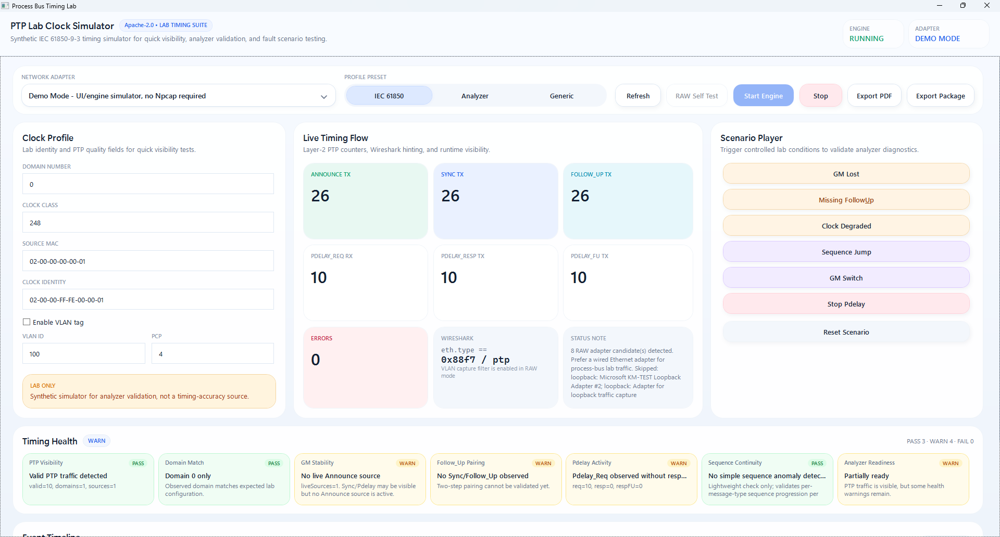

# Process Bus Timing Lab

[](https://github.com/masarray/PtpLabClock/actions/workflows/build.yml)
[](https://github.com/masarray/PtpLabClock/actions/workflows/codeql.yml)
[](https://github.com/masarray/PtpLabClock/actions/workflows/scorecard.yml)
[](https://github.com/masarray/PtpLabClock/actions/workflows/pages.yml)
[](LICENSE)

**Process Bus Timing Lab: a Windows PTP lab simulator and timing-health monitor for IEC 61850 FAT, SAT, analyzer validation, and Process Bus troubleshooting.**

Process Bus Timing Lab helps substation automation engineers see whether PTPv2 Layer-2 timing traffic is visible, decodable, VLAN/QinQ-aware, and healthy enough for lab discussion before SV and GOOSE testing becomes guesswork.

**Product website:** https://masarray.github.io/PtpLabClock/  
**Download:** https://github.com/masarray/PtpLabClock/releases  
**License:** Apache-2.0

> **Safety boundary:** this project is a lab simulator and diagnostic companion. It is **not** a certified PTP grandmaster, GPS clock, hardware-timestamped timing source, relay-acceptance reference, or replacement for IEC/IEEE 61850-9-3 compliant timing equipment.

## Product screenshot

> Add the supplied dashboard screenshot as `docs/assets/ptp-lab-dashboard.png` to show the real WPF workspace on GitHub and GitHub Pages.



*The dashboard combines Clock Profile setup, Live Timing Flow counters, Scenario Player actions, VLAN settings, RAW self-test, and Timing Health diagnostics in one compact engineering workspace.*

## Why this tool exists

In real Process Bus work, a relay, analyzer, or SV injector problem is often diagnosed too late because the timing layer is treated as invisible background infrastructure. Process Bus Timing Lab gives engineers a practical timing workspace for early-stage lab validation:

- Confirm whether PTP traffic is visible on the selected NIC.
- Validate analyzer decoding for Announce, Sync, Follow_Up, and Pdelay messages.
- Exercise untagged, VLAN-tagged, and QinQ PTP frame paths.
- Trigger controlled timing symptoms such as GM lost, missing Follow_Up, sequence jump, degraded clock, and stopped Pdelay.
- Export evidence packages for FAT/SAT notes, analyzer validation, and engineering discussion.

## Core capabilities

| Area | What it does |
|---|---|
| PTPv2 Layer-2 simulator | Builds synthetic Announce, Sync, Follow_Up, Pdelay_Req, Pdelay_Resp, and Pdelay_Resp_Follow_Up frames. |
| Timing monitor | Groups observed PTP by domain, source clock identity, message type, and basic health symptoms. |
| VLAN/QinQ validation | Builds and inspects untagged, IEEE 802.1Q VLAN, and stacked VLAN/QinQ PTP frames. |
| RAW NIC mode | Uses SharpPcap/Npcap in an isolated transport project for real adapter listing, filtering, RX capture, and lab TX. |
| Scenario player | Generates controlled lab conditions for analyzer diagnostics and training. |
| Evidence export | Produces concise PDF/ZIP session artifacts and protocol validation PCAP output. |

## Download portable EXE

When a release tag is published, GitHub Actions creates direct portable EXE artifacts:

| Artifact | Use when |
|---|---|
| `PtpLabClock.App.win-x64.portable.exe` | You want the easiest Windows desktop app. |
| `PtpLabClock.Console.win-x64.portable.exe` | You want CLI validation, RAW self-test, scripting, or CI-style checks. |
| `PtpLabClock.App.win-x64.portable.zip` | You want EXE plus license, notices, and release notes in one folder. |
| `PtpLabClock.Console.win-x64.portable.zip` | You want the CLI package with supporting release files. |

Each release also includes `checksums.txt`, `PtpLabClock.release-sbom.spdx.json`, and `ptp-validation.pcap`.

## 60-second source build

```powershell
git clone https://github.com/masarray/PtpLabClock.git
cd PtpLabClock
dotnet restore .\PtpLabClock.sln
dotnet build .\PtpLabClock.sln -c Release
dotnet test .\PtpLabClock.sln -c Release
dotnet run --project .\src\PtpLabClock.Console -- --validate-protocol --domain 0
```

Run the WPF app:

```powershell
dotnet run --project .\src\PtpLabClock.App
```

## RAW NIC quick start

RAW mode requires Npcap installed on Windows and may require Administrator privileges.

```powershell
# List RAW adapters exposed by Npcap
dotnet run --project .\src\PtpLabClock.Console -- --list

# Untagged RAW self-test
dotnet run --project .\src\PtpLabClock.Console -- --raw-self-test --adapter-index 0 --domain 0

# VLAN-tagged RAW self-test
dotnet run --project .\src\PtpLabClock.Console -- --raw-self-test --adapter-index 0 --domain 0 --vlan --vlan-id 100 --vlan-pcp 4

# Start synthetic IEC 61850 lab profile traffic with VLAN tagging
dotnet run --project .\src\PtpLabClock.Console -- --adapter-index 0 --domain 0 --profile iec61850 --vlan --vlan-id 100 --vlan-pcp 4
```

Recommended Wireshark display filter:

```text
eth.type == 0x88f7 or ptp
```

Recommended capture filter for untagged, VLAN, and QinQ Layer-2 PTP:

```text
ether proto 0x88f7 or (vlan and ether proto 0x88f7) or (vlan and vlan and ether proto 0x88f7)
```

## Who this is for

- IEC 61850 Process Bus engineers.
- FAT/SAT and commissioning engineers.
- Protection and automation test engineers.
- Developers validating SV, GOOSE, PTP, or Process Bus analyzers.
- Teams building lab workflows around ARSVIN / SV Injector and timing-health prechecks.

## Project structure

```text
src/PtpLabClock.App        WPF dashboard
src/PtpLabClock.Core       Engine, scheduler, monitor, health, diagnostics
src/PtpLabClock.Protocol   PTPv2 and Ethernet serialization/parsing
src/PtpLabClock.Pcap       SharpPcap/Npcap RAW Layer-2 transport
src/PtpLabClock.Config     JSON settings/profile helpers
src/PtpLabClock.Console    CLI validation, monitor, RAW self-test
src/PtpLabClock.Reporting  PDF/session evidence export
tests/                     xUnit regression tests
.github/workflows          CI, security, Pages, release automation
```

## Documentation

Start with the product website and repository docs:

- [Product landing page](https://masarray.github.io/PtpLabClock/)
- [Quick start](docs/quick-start.md)
- [Installation](docs/installation.md)
- [RAW NIC mode](docs/raw-nic-mode.md)
- [Protocol validation](docs/protocol-validation.md)
- [Passive monitor](docs/passive-monitor.md)
- [Timing health validation](docs/health-validation.md)
- [Wireshark validation](docs/wireshark-validation.md)
- [Product readiness audit](docs/product-readiness.md)
- [Limitations](docs/limitations.md)
- [Development](docs/development.md)

## Open-source hygiene

- License: Apache-2.0.
- Security policy: [`SECURITY.md`](SECURITY.md).
- Contribution guide: [`CONTRIBUTING.md`](CONTRIBUTING.md).
- Third-party notices: [`THIRD-PARTY-NOTICES.md`](THIRD-PARTY-NOTICES.md).
- Clean-room rule: do not copy incompatible or proprietary source code, UI assets, packet fixtures, or documentation text.

## Limitations

This project does not provide hardware timestamping, clock servo discipline, BMCA-complete grandmaster behavior, conformance certification, or relay-acceptance timing guarantees. Use certified PTP grandmaster equipment for protection, metering, and final commissioning workflows.
